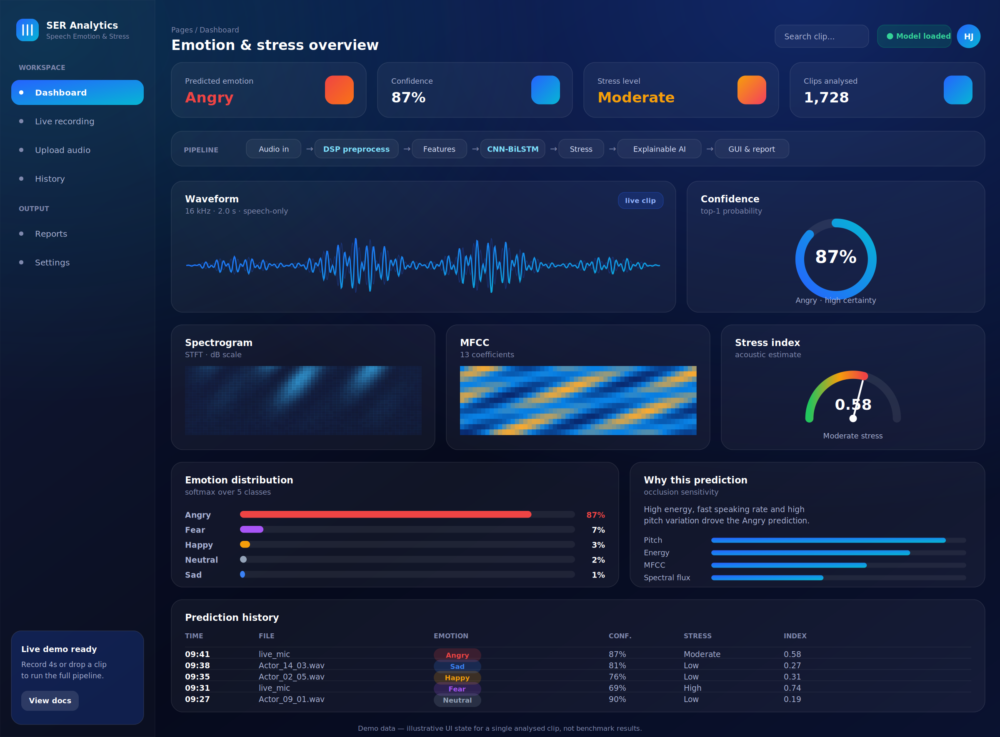
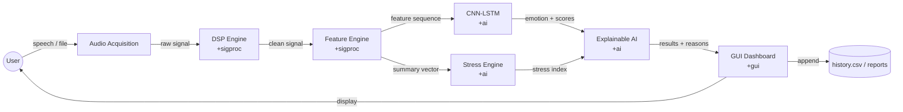
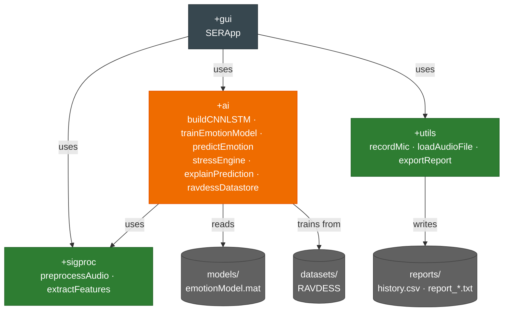
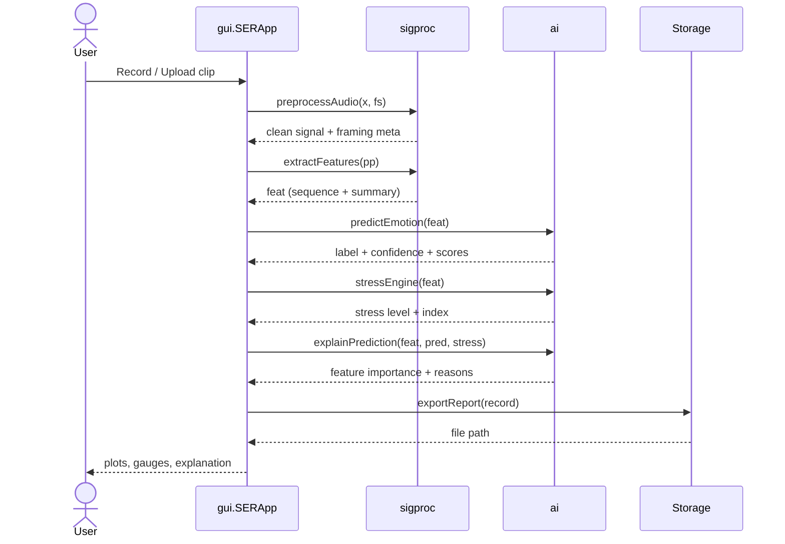

# Real-Time Speech Emotion & Stress Recognition

> Hybrid **1D CNN–BiLSTM** speech-emotion classifier + an independent **acoustic stress** index + **occlusion-based Explainable AI**, wrapped in a MATLAB **App Designer** GUI. Engineered as three decoupled modules — signal processing, AI, and UI.


Speak into the mic or upload a clip, and the system returns **(1)** the emotion with a confidence score, **(2)** a Low/Moderate/High stress level, and **(3)** a plain-language explanation of *why* — alongside live waveform, spectrogram and MFCC views.

<!-- Drop your GUI screenshot here -->
<p align="center"></p>

---
---

## Features

- **5-class emotion recognition** — Neutral, Happy, Sad, Angry, Fear — via a hybrid 1D CNN + BiLSTM trained on RAVDESS.
- **Independent stress engine** — Low/Moderate/High from acoustic correlates (pitch instability, energy variation, speaking rate, spectral flux), deliberately *not* a label on the emotion model.
- **Explainable AI** — occlusion sensitivity ranks which feature groups drove each prediction, then renders a human-readable reason.
- **Live + offline input** — microphone capture or `.wav` / `.mp3` / `.flac` upload.
- **Rich visualization** — waveform, spectrogram, MFCC heatmap, confidence + stress gauges, prediction-history table.
- **Reporting** — per-run text report cards + an appended `history.csv`.
- **Modular, testable codebase** — three MATLAB packages with a `matlab.unittest` smoke suite that runs without a trained model.

---

## Dashboard
<p align="center">
  
</p>

## How the model works

The hybrid network turns a per-frame feature sequence into one emotion label. The CNN front-end learns local spectro-temporal patterns and halves the time axis twice; the BiLSTM models how those patterns evolve across the whole utterance (both directions, since emotional cues are non-causal).

```mermaid
flowchart LR
    X["Audio<br/>48 kHz mono"] --> P["Preprocess<br/>16 kHz · VAD · norm"]
    P --> F["Feature sequence<br/>F=48 channels x T frames"]
    F --> N["Standardize<br/>(mu, sigma from train)"]
    N --> C1["Conv1D k=5, 64<br/>BN + ReLU"]
    C1 --> M1["MaxPool1D /2"]
    M1 --> C2["Conv1D k=5, 128<br/>BN + ReLU"]
    C2 --> M2["MaxPool1D /2"]
    M2 --> R["BiLSTM 128<br/>output: last"]
    R --> DR["Dropout 0.3"]
    DR --> FC1["Dense 64 + ReLU"]
    FC1 --> FC2["Dense = numClasses"]
    FC2 --> SM["Softmax"]
    SM --> Y["Emotion + confidence<br/>Neutral · Happy · Sad · Angry · Fear"]

    classDef io fill:#1565C0,color:#fff,stroke:#0D47A1;
    classDef net fill:#EF6C00,color:#fff,stroke:#E65100;
    class X,P,F,N io;
    class C1,M1,C2,M2,R,DR,FC1,FC2,SM,Y net;
```



The 48 feature channels = MFCC(13) + Delta(13) + Delta-Delta(13) + 5 spectral (centroid, rolloff, flux, spread, entropy) + pitch + ZCR + short-time energy + harmonic ratio. Standardization statistics are fit on the **training split only** and saved with the model, then re-applied at inference.

---

## Data flow



---

## Quickstart

**Requirements:** MATLAB **R2021b+**, **Audio Toolbox**, **Deep Learning Toolbox**. A microphone for live capture (optional).

```matlab
% From the PROJECT ROOT (the folder that contains +sigproc, +ai, +gui).
% Do NOT cd into a + folder — MATLAB packages resolve from the parent.

% 0) sanity check (no dataset/model needed)
runtests("tests/test_pipeline.m")

% 1) confirm RAVDESS labels parse (recursive; point at the extracted root)
ai.ravdessDatastore("datasets");

% 2) train — saves models/emotionModel.mat automatically
ai.trainEmotionModel("datasets")

% 3) command-line end-to-end
main_demo("datasets/.../Actor_05/03-01-05-01-01-01-05.wav")   % or main_demo to use the mic

% 4) launch the GUI (auto-loads the trained model)
gui.SERApp
```

To train on all eight RAVDESS emotions instead of five:

```matlab
ai.trainEmotionModel("datasets", ...
    classes=["Neutral" "Calm" "Happy" "Sad" "Angry" "Fear" "Disgust" "Surprised"])
```

The stress engine and all plots work **without** a trained model; emotion + XAI require `models/emotionModel.mat`.

---

## Project structure

```
SER_Stress_System/
├── main_demo.m              end-to-end CLI run (no GUI) — best for quick tests
├── +sigproc/                MODULE 1: preprocessAudio, extractFeatures
├── +ai/                     MODULE 2: buildCNNLSTM, trainEmotionModel, predictEmotion,
│                                      stressEngine, explainPrediction, ravdessDatastore
├── +gui/                    MODULE 3: SERApp (uifigure dashboard)
├── +utils/                  recordMic, loadAudioFile, exportReport
├── models/                  emotionModel.mat (created by training)
├── datasets/                RAVDESS root: audio_speech_actors_01-24/Actor_NN/
├── reports/                 history.csv + report_*.txt (created at runtime)
├── tests/                   test_pipeline.m (matlab.unittest)
└── docs/                    DESIGN.md (full engineering doc), screenshot.png
```

---

## Component diagram

Package dependencies — the GUI depends on all engines; the engines never depend on the GUI.



---

## Inference sequence



---

## Results

> Fill these in from your own training run — do **not** publish placeholder numbers. After `ai.trainEmotionModel`, the validation accuracy is printed and a confusion matrix figure is shown.

| Metric | Value |
|---|---|
| Classes | Neutral, Happy, Sad, Angry, Fear |
| Train / val split | 80 / 20 (stratified) |
| Validation accuracy | _report yours_ |
| Per-class F1 | _report yours_ |
| Cross-corpus accuracy (unseen set) | _report yours_ |
| Inference latency (4 s clip, CPU) | _report yours_ |

For a defensible viva, also report a confusion matrix and a cross-corpus test (train on RAVDESS, test on TESS/SAVEE) to show generalisation rather than memorisation.

---

## Explainability & stress

**Explainability** uses occlusion sensitivity: each feature group (MFCC, Delta, Delta-Delta, pitch, energy, ZCR, spectral) is zeroed in turn and the model is re-run; the drop in the predicted-class probability ranks that group's influence on *this* clip. A natural-language layer then phrases it, e.g. *"high energy + fast speaking rate + high pitch variation contributed to the Angry prediction."*

**Stress** is an unsupervised acoustic index, **not** a trained class — no standard SER corpus carries a stress label. It is a weighted blend of pitch instability (0.30), energy variation (0.25), speaking rate (0.20), pitch level (0.15) and spectral flux (0.10), thresholded into Low (<0.40) / Moderate / High (>=0.70). The normalisation ranges are placeholders: **calibrate them on your own relaxed-vs-stressed recordings** before making any quantitative claim, and state this in the report.

---

## Troubleshooting

| Symptom | Cause | Fix |
|---|---|---|
| `Unable to resolve the name 'sigproc.preprocessAudio'` | Not in project root, or `cd`'d into a `+` folder | `cd` to the folder that *contains* `+sigproc` |
| Package passes once then errors | A package named after a reserved namespace (e.g. `dsp` clashes with DSP System Toolbox) | Rename it; never reuse a built-in namespace |
| Spectrogram blank / `Expected X to be ... double` in GUI | `spectrogram()` has no `spectrogram(ax,...)` syntax | Compute the STFT with output args, then `imagesc(ax, T, F, ...)` |
| `trainNetwork ... Invalid network ... Layer 'pool1'` | `sequenceInputLayer` default `MinLength=1` fails the pooling check | Pass `MinLength` = shortest training sequence to `buildCNNLSTM` |
| `Undefined function 'audioFeatureExtractor' / 'convolution1dLayer'` | Missing toolbox / MATLAB < R2021b | Install Audio + Deep Learning Toolboxes; update MATLAB |

---

## Limitations

- Trained on **acted** emotion (RAVDESS) — the standard limitation of the field; real-world spontaneous speech differs.
- RAVDESS is small (~1.4k speech clips) and class-imbalanced (Neutral has ~half the clips of other classes) → modest accuracy, watch for overfitting. Add CREMA-D and/or augmentation to improve.
- **Per-utterance**, not frame-by-frame streaming — "real-time" means near-real-time per clip.
- Stress index is heuristic and **uncalibrated** by default.

---

## Roadmap

- [ ] Data augmentation (`audioDataAugmenter`: pitch shift, time stretch, additive noise)
- [ ] CREMA-D support + cross-corpus evaluation
- [ ] Real-time emotion **timeline** (sliding window over a longer recording)
- [ ] PDF report via Report Generator / `exportgraphics`
- [ ] Trend analytics over `history.csv`
- [ ] Migrate `trainNetwork` → `trainnet` for R2024a+

---

## Thesis figure captions

> IEEE-style captions for the diagrams above — paste under each rendered figure.

- **Fig. 1.** Layered architecture of the proposed real-time speech emotion and stress recognition framework, comprising input, signal-processing, feature, AI, explainability, presentation and storage layers implemented as decoupled MATLAB packages.
- **Fig. 2.** Hybrid 1-D CNN–BiLSTM classification pipeline, showing tensor flow from a 48-channel per-frame feature sequence through two convolution–pooling blocks, a bidirectional LSTM, and dense–softmax layers to a five-class emotion posterior.
- **Fig. 3.** Data-flow diagram of a single inference, tracing the speech signal from acquisition through preprocessing, feature extraction, parallel emotion and stress estimation, explanation, visualisation and report logging.
- **Fig. 4.** Component (package) dependency diagram of the MATLAB implementation, illustrating the unidirectional dependence of the presentation layer on the signal-processing and AI engines.
- **Fig. 5.** Runtime interaction (sequence) diagram for one prediction, detailing the message exchange between the GUI, signal-processing, AI and storage components.

---

## Dataset & citation

This project uses the **RAVDESS** speech set (CC BY-NC-SA 4.0). If you publish, cite:

> S. R. Livingstone and F. A. Russo, "The Ryerson Audio-Visual Database of Emotional Speech and Song (RAVDESS): A dynamic, multimodal set of facial and vocal expressions in North American English," *PLoS ONE*, vol. 13, no. 5, e0196391, 2018.

Verify the exact citation and license terms on the official RAVDESS release page before redistribution.

---

## Design document

The full engineering design — development roadmap, dataset comparison, per-feature rationale, hyperparameters, testing strategy, SRS/UML templates, and advanced-feature ranking — lives in **[`docs/DESIGN.md`](docs/DESIGN.md)**.

## License

No license is set yet. Add a `LICENSE` file (MIT is common for student projects) and note that RAVDESS itself is CC BY-NC-SA 4.0, which restricts commercial use of the data.
